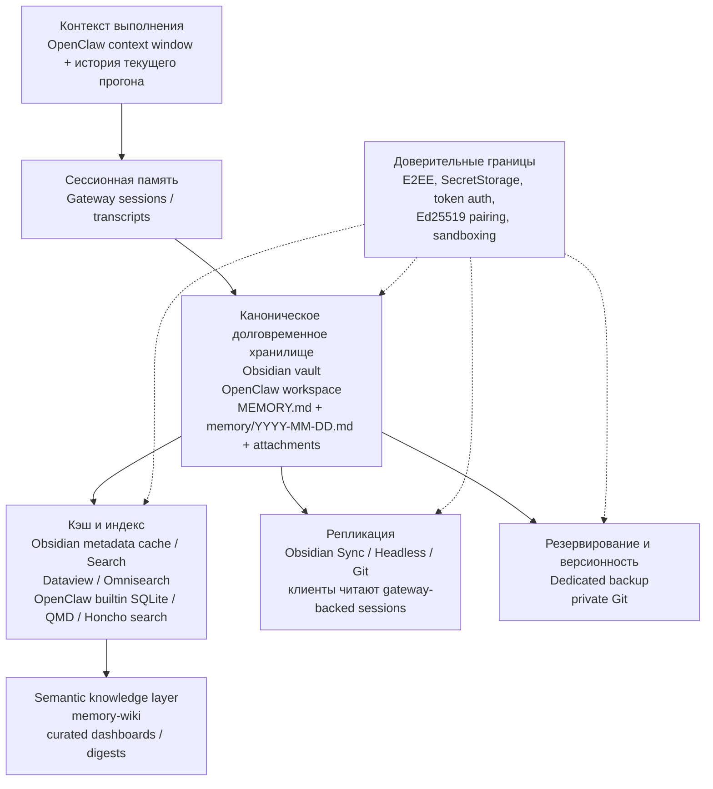

# Память для Obsidian и OpenClaw

## Executive summary

Если смотреть на связку **Obsidian + OpenClaw** как на единую систему памяти, то самым правильным “источником истины” оказываются **локальные файлы на диске**, а не кэш, не индекс и не чат-история. У Obsidian это vault — локальная папка с Markdown-файлами и вложениями; у OpenClaw — workspace, где память живёт в `MEMORY.md`, ежедневных заметках `memory/YYYY-MM-DD.md` и, при желании, в `DREAMS.md`. OpenClaw прямо пишет, что модель “помнит” только то, что сохранено на диск, и что скрытого состояния нет; Obsidian, со своей стороны, тоже хранит заметки как обычные локальные Markdown-файлы. citeturn21view0turn34view0

Из этого следует главный архитектурный вывод: **подключать модули памяти нужно снизу вверх**. Сначала — каноническое долгоживущее хранилище, затем резервирование и доверительные границы, затем локальный индекс/поиск, потом мост между Obsidian и OpenClaw, и только после этого — синхронизация, продвинутые memory-backend’ы и knowledge-layer вроде `memory-wiki`. Это не “официальная обязательная последовательность”, а инженерная рекомендация, вытекающая из того, что индексы зависят от файлов, sync не заменяет backup, а `memory-wiki` сам описан как слой **поверх** активной memory-системы, а не вместо неё. citeturn12view4turn21view7turn24view0

Для **первой очереди** я бы рекомендовал минимальный, но уже рабочий стек: локальный vault Obsidian, один workspace OpenClaw, базовый `memory-core` с builtin backend, отдельный backup или private Git-репозиторий, и один интерфейсный мост: либо официальный Obsidian-плагин OpenClaw, либо Local REST API для контролируемой автоматизации. Продвинутые вещи — QMD, Honcho, `active-memory`, `memory-wiki`, Dataview/Omnisearch, hooks/webhooks — лучше добавлять только после того, как стабилизированы файлы, доступы, резервирование и базовый recall. citeturn21view4turn22view0turn36view3turn14view1turn24view0

Отдельно важно: архитектура “**vault = workspace**” очень удобна и прямо поддерживается официальным Obsidian-плагином OpenClaw фразой “Your vault becomes the workspace”, но у неё есть цена. OpenClaw подчёркивает, что workspace — это default cwd, **не жёсткий sandbox**; без sandboxing инструменты могут выйти за пределы рабочего каталога по абсолютным путям. Поэтому режим одного общего хранилища — лучший для простоты и целостности, но не для максимальной изоляции. Если нужен более строгий контур, лучше держать отдельный workspace и отправлять в него только выбранные заметки или разделы Obsidian. citeturn21view4turn34view1

## Как устроены уровни памяти

Ни Obsidian, ни OpenClaw не используют одну и ту же официальную терминологию для “уровней памяти”, поэтому ниже — **аналитическая модель**, собранная из их первичных документов. В этой модели Obsidian отвечает прежде всего за **долговременное локальное знание в файлах** и human-facing интерфейс, а OpenClaw — за **контекст выполнения, сессии, recall, promotion и memory runtime**. citeturn21view0turn34view0turn34view2turn34view5

| Уровень | Что это такое | Реализация в Obsidian | Реализация в OpenClaw | Каноничность | Источники |
|---|---|---|---|---|---|
| Контекст выполнения | То, что попадает в текущий “рабочий кадр” модели или UI | В Obsidian нет отдельного формального memory-runtime; в связке с OpenClaw контекст обычно задаётся активной заметкой, поиском и тем, что плагин отправляет в агент | `Context` = system prompt, история сообщений сессии, tool results, вложения; ограничен context window модели | Производный, краткоживущий | OpenClaw Context citeturn34view2 |
| Сессионная память | История текущего разговора и её жизненный цикл | В самой Obsidian это не канонический слой; при использовании ObsidianClaw chat history приходит с gateway | Сессии переиспользуются до reset; store и transcripts живут на gateway-host в `sessions.json` и `*.jsonl` | Канонична для чатов, но не для заметок | OpenClaw Session Management; ObsidianClaw history citeturn21view8turn13view13 |
| Долговременная файловая память | Основное долговечное знание на диске | Vault — локальная папка с Markdown, вложениями и `.obsidian` | Workspace, где лежат `MEMORY.md`, `memory/YYYY-MM-DD.md`, `DREAMS.md` | **Главный источник истины** | Obsidian vault/data storage; OpenClaw memory overview citeturn12view1turn21view0turn34view0 |
| Производные индексы и кэш | Ускорение поиска и структурных представлений | Metadata cache, core Search, Dataview, Omnisearch | Builtin SQLite index, embedding cache, QMD sidecar, Honcho search | Производный, пересобираемый | Obsidian metadata cache/Search; Dataview; Omnisearch; OpenClaw builtin/QMD/memory config/Honcho citeturn12view0turn28view0turn29view0turn29view1turn22view0turn21view5turn22view1turn34view4 |
| Слой compiled knowledge | Не сырые заметки, а собранная knowledge-структура с provenance | В Obsidian это делают в основном плагины и curated views | `memory-wiki` создаёт отдельный wiki-vault, digests, claims, dashboards и wiki-tools | Производный, но высокого уровня | OpenClaw Memory Wiki; Dataview docs citeturn23view0turn24view0turn29view0 |
| Репликация, восстановление и защита | Доставка копий, version history, backup, шифрование | Obsidian Sync / Headless Sync / Git / dedicated backup / E2EE remote vault | Gateway как source of truth для session-state; private Git для workspace; отдельное хранение config/credentials/sessions | Защитный и транспортный слой, не источник истины | Obsidian Sync/backup/security; OpenClaw workspace/session docs citeturn12view3turn12view4turn21view1turn21view2turn33view0turn33view1turn36view3turn36view1turn21view8 |

Диаграмма ниже показывает рекомендуемую иерархию зависимостей: индексы, sync и knowledge-layer должны опираться на стабильное файловое хранилище, а защита — накрывать все верхние слои. Это следует из того, что Obsidian и OpenClaw оба считают файлы на диске базовым носителем, а derived-слои — пересобираемыми поверх него. citeturn21view0turn34view0turn22view0turn24view0

## Какие модули памяти применимы к Obsidian и OpenClaw

Ниже — практическая таблица не “всех возможных плагинов”, а именно **типов модулей**, которые реально формируют память в этой связке. Очередь подключения — это рекомендуемый приоритет, а не формальный стандарт вендора. Он выведен из зависимостей между слоями. citeturn12view4turn21view7turn24view0

| Тип модуля | Что делает | Obsidian | OpenClaw | Зависимости | Когда подключать | Основной риск, если подключить слишком рано | Источники |
|---|---|---|---|---|---|---|---|
| **Persistent storage** | Даёт каноническое долгоживущее хранилище | Vault — локальная папка с Markdown и вложениями; можно использовать существующую папку | Workspace; память в `MEMORY.md`, daily notes и `DREAMS.md`; workspace — “home” агента | Нет | **Очередь 1** | Получить два расходящихся источника истины: vault и workspace живут отдельно и дублируют знания | Obsidian vault/data storage; OpenClaw workspace/memory overview citeturn12view1turn21view0turn34view1turn34view0 |
| **Backup / versioning** | Делает восстановимую копию, а не просто репликацию | Obsidian советует dedicated one-way backup; sync не заменяет backup | OpenClaw рекомендует private Git-репозиторий для workspace; config/secrets/sessions хранить отдельно и не коммитить | Persistent storage | **Очередь 2** | Потерять источник истины и заметить это только после sync-конфликта или неудачной автоматизации | Obsidian backup; OpenClaw workspace Git backup citeturn12view4turn36view3turn36view1 |
| **Encryption / secrets / trust boundary** | Защищает удалённую репликацию, токены и доверенный контур | Obsidian Sync по умолчанию предлагает E2EE для remote vault; local vault Obsidian **не шифрует**; для plugin secrets есть SecretStorage | Gateway token, device pairing, минимизация доступа, sandboxing; workspace не sandbox по умолчанию | Persistent storage | **Очередь 3** | Открыть write-доступы агенту или отправить secrets в repo/плагин-данные без защиты | Obsidian Sync security & SecretStorage; OpenClaw security/workspace; ObsidianClaw security model citeturn21view1turn21view3turn20view10turn34view1turn35view2 |
| **Cache** | Ускоряет UI и поиск, но не является источником истины | Metadata cache питает Graph/Outline и может быть пересобран | Embedding cache в SQLite уменьшает re-embedding; также индексы могут пересобираться | Persistent storage | **Очередь 4** | Начать лечить “память” на уровне кэша вместо исправления файловой структуры | Obsidian metadata cache; OpenClaw memory config cache citeturn12view0turn22view1 |
| **Basic indexing / search** | Даёт recall поверх файлов | Core Search; при росте базы — Dataview для metadata-query, Omnisearch для OCR/PDF | Builtin Memory Engine по умолчанию: FTS5 + embeddings + hybrid search; без provider остаётся keyword search | Persistent storage; для vector — embedding provider | **Очередь 4** | Индексировать нестабильные папки и потом долго разруливать шум/дубликаты | Obsidian Search; Dataview; Omnisearch; OpenClaw builtin engine citeturn28view0turn29view0turn29view1turn22view0 |
| **Bridge / integration plugin** | Соединяет Obsidian и OpenClaw в одном рабочем контуре | Официальный ObsidianClaw: “vault becomes the workspace”; Local REST API даёт HTTPS + API key + точечный PATCH/CRUD | Plugins/skills/hooks/webhooks регистрируют tools и workflow | Persistent storage; auth token; security baseline | **Очередь 5** | Открыть слишком широкий write-surface до того, как настроены backup и доступы | ObsidianClaw; Local REST API; OpenClaw tools/plugins/hooks citeturn21view4turn35view2turn14view1turn34view5turn20view11 |
| **Sync / replication** | Разносит копии между устройствами, но не заменяет backup | Obsidian Sync / third-party cloud / Syncthing / Git; нельзя смешивать несколько sync-решений на одних и тех же файлах; Headless Sync полезен для automation, но не вместе с desktop Sync на том же устройстве | Session-state живёт на gateway-host; клиенты читают sessions через gateway; для ObsidianClaw cross-device нужен remote gateway и чаще всего tailnet/Tailscale | Persistent storage; auth; стабильный bridge | **Очередь 6** | Конфликты, дубли, “рассыпающаяся” история, ложное ощущение резервирования | Obsidian sync docs/headless/switch; OpenClaw sessions/messages; ObsidianClaw remote setup citeturn12view3turn21view2turn33view0turn33view1turn21view8turn18view1turn35view0 |
| **Advanced memory backend** | Делает recall глубже или шире базового индекса | В Obsidian это обычно не отдельный “memory backend”, а плагины для richer search/query | QMD = local-first sidecar с BM25+vector+reranking и extra paths/transcripts; Honcho = service-based cross-session memory с user/agent modeling | Stable storage; basic indexing; security | **Очередь 7** | Увеличить сложность и доверительную поверхность без явной бизнес-пользы | OpenClaw QMD; Honcho citeturn21view5turn30view5 |
| **Pre-reply recall / automation** | Встраивает память в ответ до генерации текста | В Obsidian нет нативного аналога; это уже слой агентной логики | `active-memory` запускает bounded pre-reply sub-agent и использует только `memory_search`/`memory_get`; hooks/webhooks автоматизируют события | Working search backend; gateway; policies | **Очередь 7** | Автоматизировать recall до понимания, что именно и где должно запоминаться | Active Memory; Hooks citeturn34view3turn14view3turn20view11 |
| **Compiled knowledge layer** | Собирает не сырые заметки, а поддерживаемую knowledge-структуру | Dataview-таблицы и curated views полезны человеку, но не заменяют source-of-truth | `memory-wiki` компилирует pages, claims, evidence, dashboards и digests; сам не заменяет active memory plugin | Active memory backend уже работает; stable files | **Очередь 8** | Построить красивый wiki-слой над неработающим recall и получить “правдоподобный, но хрупкий” knowledge stack | Memory Wiki; Dataview docs citeturn23view0turn24view0turn29view0 |

Есть ещё одно важное различие внутри OpenClaw. **`memory-core`** — это основной memory-плагин по слоту `plugins.slots.memory` и он выбран по умолчанию. Но **`active-memory`** — это отдельный плагин, который не заменяет backend, а добавляет предответный recall; он работает через уже существующие `memory_search` и `memory_get`. Это часто путают, а на практике это два разных слоя и два разных этапа внедрения. citeturn21view7turn34view0turn34view3

## Зависимости и приоритет подключения

Ниже — рекомендуемая последовательность подключения. Она опирается на принцип: **сначала то, что является каноническим и восстановимым; потом то, что лишь ускоряет, реплицирует или автоматизирует**. Это соответствует и Obsidian-логике “notes are local files”, и OpenClaw-логике “memory is what got written to disk”. citeturn21view0turn34view0

| Очередь | Что подключать | Почему именно здесь | Жёсткие зависимости | Предпочтительный выбор |
|---|---|---|---|---|
| **1** | Каноническое хранилище | Без него все индексы, sync и плагины будут висеть в воздухе | Нет | Один vault Obsidian и один workspace OpenClaw; по умолчанию — локально на том же хосте, где живёт gateway citeturn12view1turn34view1 |
| **2** | Backup и versioning | Sync не заменяет backup; именно здесь закладывается откат и recoverability | Очередь 1 | Dedicated backup для vault + private Git для workspace, причём без `~/.openclaw/` и secrets citeturn12view4turn36view3turn36view1 |
| **3** | Доверительные границы и secrets | До write-автоматизации нужно понять, кто имеет доступ, что шифруется и где лежат токены | Очередь 1 | E2EE для remote vault, SecretStorage/API key auth, gateway token, device pairing, sandbox при необходимости citeturn21view1turn21view3turn20view10turn34view1turn35view2 |
| **4** | Базовый индекс и recall | После стабилизации файлов можно строить пересобираемый derived-слой | Очередь 1 | В Obsidian — core Search; в OpenClaw — builtin engine; без необходимости не прыгать сразу в QMD/Honcho citeturn28view0turn22view0 |
| **5** | Мост Obsidian ↔ OpenClaw | Теперь уже безопасно дать агенту узкий вход в vault/workspace | Очереди 1–3 | Либо официальный ObsidianClaw для “chat in vault”, либо Local REST API для более контролируемой автоматизации citeturn21view4turn14view1 |
| **6** | Sync / multi-device replication | Только после того, как локальный контур уже устойчив и восстановим | Очереди 1–5 | Один sync-метод на одну копию данных; не смешивать Obsidian Sync с другими sync-service на тех же файлах; для automation — Headless Sync, но не вместе с desktop Sync на том же устройстве citeturn33view0turn21view2turn33view1 |
| **7** | Продвинутые memory-backend’ы и pre-reply recall | Здесь уже понятны реальные требования к recall, latency и trust boundary | Очереди 1–6 | QMD — если нужны extra paths, transcripts и reranking; Honcho — если нужна cross-session user-modeling; `active-memory` — если нужен recall before reply citeturn21view5turn30view5turn34view3 |
| **8** | Knowledge wiki, dashboards, hooks | Это верхний слой, полезный только когда нижние уже надёжны | Очереди 1–7 | `memory-wiki`, curated Dataview views, hooks/webhooks для ingestion и maintenance citeturn24view0turn20view11turn29view0 |

Самый спорный момент — **ставить ли sync раньше bridge-плагина**. Мой вывод: **нет**, если ты строишь single-machine или single-gateway систему. Сначала полезнее получить локально устойчивую, предсказуемую память, и уже потом размножать её по устройствам. Иначе ты размножаешь не архитектуру, а потенциально ошибочную конфигурацию. Официальные документы Obsidian прямо предупреждают о конфликтах при нескольких sync-механизмах, а Headless Sync отдельно предупреждает не использовать его рядом с desktop Sync на одном устройстве. citeturn33view0turn21view2

## Рекомендуемая поэтапная схема интеграции

### Минимальный набор первой очереди

Для первого, практически полезного и сравнительно безопасного запуска я бы собрал систему так:

| Слой | Что взять | Почему это минимум |
|---|---|---|
| Хранилище | Один локальный vault Obsidian | Это простой, прозрачный и человекочитаемый source-of-truth в Markdown-файлах citeturn21view0turn12view1 |
| Агентная память | `memory-core` + builtin backend | Это default memory-path OpenClaw без внешних зависимостей; FTS5, vector и hybrid доступны сразу или после настройки embeddings citeturn22view0turn21view7 |
| Интерфейс | Официальный ObsidianClaw **или** Local REST API | Первый даёт нативный chat sidebar и “Ask about this note”; второй — безопасный HTTPS/API-key интерфейс с точечным PATCH citeturn21view4turn14view1 |
| Защита | Gateway token, базовая сегрегация secrets, backup | Без этого “память” будет работать, но эксплуатация будет хрупкой и рискованной citeturn35view2turn12view4turn36view1 |
| Откат | Dedicated backup и/или private Git | И Obsidian, и OpenClaw по сути файловые системы памяти; значит, откат по файлам — самый дешёвый и надёжный способ recovery citeturn12view4turn36view3 |

В этом режиме лучше **не включать dreaming, QMD, Honcho и `memory-wiki` в первый день**. Во-первых, builtin engine уже достаточно хорош для старта. Во-вторых, даже сами документы OpenClaw позиционируют QMD как слой “когда нужен reranking / extra paths / transcript indexing”, Honcho — как сервис для cross-session user modeling, а `memory-wiki` — как knowledge-layer рядом с активной memory-системой, а не вместо неё. citeturn22view0turn21view5turn30view5turn24view0

### Что добавлять во второй и третьей очереди

Во **второй очереди** имеет смысл добавить **multi-device sync** и только один механизм репликации для каждого корпуса данных. Для vault-данных — Obsidian Sync, third-party cloud, Syncthing или Git; для session-state надо помнить, что source-of-truth — gateway-host, а не клиентские UI. Если используешь ObsidianClaw с удалённым gateway, официальный README описывает схему через tailnet/Tailscale, gateway token и device pairing. citeturn12view3turn18view1turn35view0

В **третьей очереди** выбирай один из двух путей по реальной потребности:

Первый путь — **усилить локальный recall**. Тогда уместен **QMD**: он добавляет reranking, query expansion, индексацию extra paths и session transcripts, при этом остаётся local-first и имеет автоматический fallback к builtin engine. Это хороший вариант, если основной pain point — качество поиска по большому локальному корпусу. citeturn21view5turn22view1

Второй путь — **получить cross-session user modeling**. Тогда уместен **Honcho**: он сохраняет разговоры после каждого AI-turn, строит user/agent profiles и подмешивает релевантный контекст в `before_prompt_build`. Это путь не к “лучшему индексу файлов”, а к более “социальной” и профильной памяти агента. Honcho при этом может работать вместе с builtin/QMD, а не обязательно вместо них. citeturn30view5

### Что оставлять на последнюю очередь

На последнюю очередь я бы отложил три вещи.

Первая — **`active-memory`**. Это полезный, но уже тонкий слой: он запускает ограниченный memory-subagent до основного ответа и допускает только `memory_search` и `memory_get`. То есть он улучшает естественность recall, но имеет смысл только там, где основной memory backend уже стабилен. citeturn34view3turn14view3

Вторая — **`memory-wiki`**. Он великолепен, когда нужна provenance-rich knowledge-база, dashboards, claims/evidence и digest-слой для runtime. Но сам же OpenClaw рекомендует сначала оставить активный memory plugin для recall/promotion/dreaming, затем включить `memory-wiki`, и стартовать с `isolated`, а не `bridge`, если bridge не нужен явно. citeturn24view0

Третья — **human-facing аналитика в Obsidian**: Dataview и Omnisearch. Dataview — живой индекс и query engine по metadata, причём он подчёркнуто ориентирован на отображение, а не на редактирование. Omnisearch полезен, если corpus уже включает PDF, OCR и просто нужен быстрый “второй поиск” сверх core Search. Но эти плагины не должны становиться источником истины: источник истины всё ещё лежит в Markdown-файлах и memory-файлах OpenClaw. citeturn29view0turn29view1turn21view0turn34view0

## Чек-лист внедрения

- [ ] **Зафиксировать источник истины**: решить, будет ли Obsidian vault и OpenClaw workspace одной и той же папкой, или workspace будет отдельным контуром с выборочной синхронизацией/мостом. Для простоты обычно выигрывает единый vault/workspace; для повышенной безопасности — отдельный workspace. citeturn21view4turn34view1
- [ ] **Создать локальный vault вне конфликтных sync-папок**, если в дальнейшем планируется Obsidian Sync. Obsidian не рекомендует держать тот же vault одновременно под Obsidian Sync и сторонним cloud-sync. citeturn33view0turn33view1
- [ ] **Поднять OpenClaw gateway и workspace на одном хосте**, где живёт память, чтобы вначале не усложнять систему сетью и device-pairing. citeturn34view1turn35view1
- [ ] **Сразу включить backup**, а не “позже”. Для Obsidian — dedicated one-way backup; для OpenClaw workspace — private Git repo. citeturn12view4turn36view3
- [ ] **Не коммитить `~/.openclaw/` и secrets**. OpenClaw отдельно перечисляет, что config, credentials, sessions и skills лежат вне workspace и не должны попадать в repo. citeturn36view1
- [ ] **Начать с builtin engine**, а не с QMD/Honcho. Builtin backend — default, не требует extra dependencies и уже поддерживает FTS5 + vector + hybrid search. citeturn22view0
- [ ] **Проверить базовый recall**, прежде чем строить knowledge-layer: `memory_search` должен реально находить `MEMORY.md` и daily notes. Только после этого имеет смысл `active-memory` и `memory-wiki`. citeturn34view0turn34view3turn24view0
- [ ] **Выбрать ровно один основной мост**: либо ObsidianClaw для нативного chat/sidebar опыта, либо Local REST API для программного контролируемого доступа. citeturn21view4turn14view1
- [ ] **Только после стабилизации локального контура включать sync**. Для automation на сервере можно использовать Headless Sync, но его нельзя использовать на том же устройстве вместе с desktop Sync. citeturn21view2
- [ ] **Если нужен richer recall по extra paths и transcript recall — брать QMD**. Если нужен user/profile memory across sessions — брать Honcho. Если нужен provenance/dashboards — брать `memory-wiki`. citeturn21view5turn30view5turn24view0
- [ ] **При выборе “vault = workspace” оценить sandboxing**. Workspace в OpenClaw — не hard sandbox по умолчанию; при необходимости включать sandbox и работать через него. citeturn34view1
- [ ] **Если нужна удалённая Obsidian-интеграция**, настраивать network-layer отдельно: tailnet/Tailscale, gateway token, device approval. citeturn35view0turn35view2

## Первичные источники

**Obsidian**
- Хранение данных, vault, локальные Markdown-файлы, metadata cache: документация Obsidian Help. citeturn21view0turn12view0turn12view1
- Sync, remote/local vault, backup, E2EE, Headless Sync и ограничения смешанной синхронизации: Obsidian Help. citeturn12view3turn12view4turn21view1turn21view2turn33view0turn33view1
- Core Search: официальная документация Obsidian Help. citeturn28view0
- SecretStorage для plugin secrets: Obsidian Developer Docs. citeturn21view3
- Review/vetting community plugins: Obsidian Developer Docs. citeturn27search0turn27search1

**OpenClaw**
- Workspace как memory-home и не-hard-sandbox: OpenClaw docs. citeturn34view1
- Memory overview, memory files, `memory_search`/`memory_get`, absence of hidden state: OpenClaw docs. citeturn34view0
- Context vs memory, sessions, transcripts, session lifecycle: OpenClaw docs. citeturn34view2turn21view8turn18view1
- Builtin Memory Engine, indexing, FTS5, hybrid search, index storage: OpenClaw docs. citeturn22view0
- QMD Memory Engine: OpenClaw docs. citeturn21view5
- Honcho Memory: OpenClaw docs. citeturn30view5
- Active Memory: OpenClaw docs. citeturn34view3
- Memory Wiki: OpenClaw docs. citeturn23view0turn24view0
- Plugins, slots, discovery/precedence, enablement rules: OpenClaw docs. citeturn21view6turn21view7turn20view6
- Hooks и trust-boundary/security: OpenClaw docs. citeturn20view11turn20view10

**Релевантные плагины**
- Официальный Obsidian-плагин OpenClaw / ObsidianClaw README. citeturn21view4turn35view0turn35view2
- Local REST API for Obsidian. citeturn14view1turn14view0
- Obsidian Git. citeturn13view15
- Obsidian Dataview. citeturn29view0
- Omnisearch for Obsidian. citeturn29view1turn13view17

Итоговая рекомендация в одной фразе: **строить память для Obsidian + OpenClaw нужно как файловую систему с надстройками, а не как набор “умных” плагинов** — сначала файлы, backup и trust boundary, затем recall/index, затем bridge, затем sync, и только потом advanced-memory и compiled knowledge. Это лучше всего согласуется и с архитектурой Obsidian, и с тем, как OpenClaw сам определяет память. citeturn21view0turn34view0turn24view0